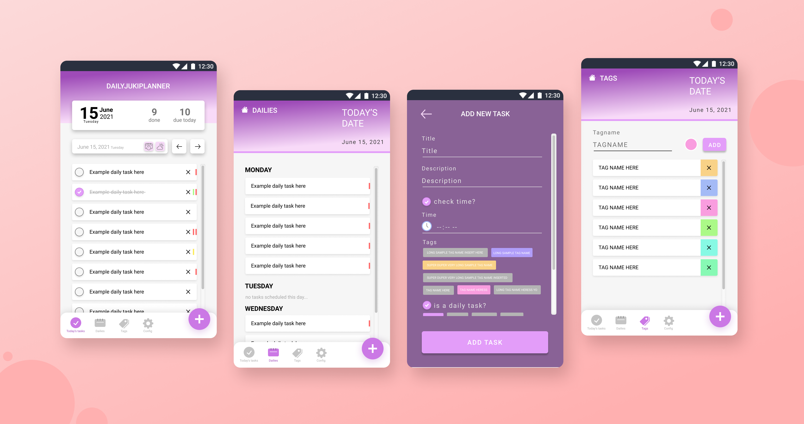

<p align="center">
  <a href="https://storybook.js.org/">
    
  </a>
</p>

<h3 align="center">DAILY PLANNER</h3>
<p align="center">A PWA React application to help me (& hopefully someone else) stay organized c:</p>

## Figma design

https://www.figma.com/file/1jsHNKFAHhiX95oUz7eEJo/Daily-Planner?node-id=0%3A1

## Built With

- JavaScript / TypeScript
- React framework
- HTML5
- CSS3
- LocalStorage API
- Service Workers (PWA)
- Spaghetti code

## Setup

If you want to check out the spaghetti, follow these easy instructions:

##### 1. Clone the repository

```
git clone https://github.com/Shirajuki/daily-planner.git
```

##### 2. Run the spaghetti

```
cd daily-planner && npm install && npm start
```

##### 3. The website view spaghetti should run at `http://localhost:3000/`

## License

Distributed under the MIT License. See [`LICENSE`](./LICENSE) for more information.
